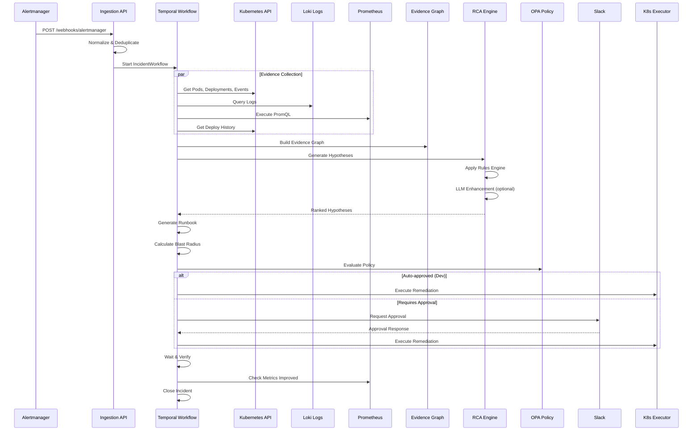

# Kubernetes AIOps Evidence Graph Platform

[](https://www.python.org/downloads/)
[](https://opensource.org/licenses/MIT)

A **production-ready** AIOps platform for automated incident detection, root cause analysis (RCA), and safe remediation in Kubernetes environments. Built with Temporal workflows, Neo4j evidence graphs, and LLM-enhanced diagnostics.

## 🎯 Key Features

- **Automated Alert Ingestion** - Webhooks for Alertmanager, Grafana, and Prometheus
- **Evidence Graph** - Neo4j-powered graph connecting incidents to infrastructure
- **Multi-Source Collection** - Kubernetes API, logs (Loki), metrics (Prometheus), deploy diffs
- **Deterministic RCA** - Rules engine with 10+ diagnosis patterns (CrashLoop, OOM, etc.)
- **LLM Enhancement** - Optional Gemini/OpenAI/Ollama integration for hypothesis enrichment
- **Safe Remediation** - OPA policy gates, blast radius assessment, approval workflows
- **Runbook Generation** - Actionable kubectl commands, PromQL queries, dashboard links
- **ChatOps Integration** - Slack approvals, Jira ticket creation
- **Full Observability** - Prometheus metrics, OpenTelemetry tracing, Grafana dashboards

## 📐 Architecture

```
┌─────────────────┐     ┌─────────────────┐     ┌─────────────────┐
│   Alertmanager  │────▶│  Alert Ingestion│────▶│    Temporal     │
│     Grafana     │     │    (FastAPI)    │     │    Workflow     │
└─────────────────┘     └─────────────────┘     └─────────────────┘
                                                        │
        ┌───────────────────────────────────────────────┼───────────────────────────────────────────────┐
        │                                               │                                               │
        ▼                                               ▼                                               ▼
┌─────────────────┐                             ┌─────────────────┐                             ┌─────────────────┐
│   Kubernetes    │                             │   Prometheus    │                             │      Loki       │
│   Collector     │                             │   Collector     │                             │   Collector     │
└────────┬────────┘                             └────────┬────────┘                             └────────┬────────┘
         │                                               │                                               │
         └───────────────────────────────────────────────┼───────────────────────────────────────────────┘
                                                         │
                                                         ▼
                                                 ┌─────────────────┐
                                                 │  Evidence Graph │
                                                 │    (Neo4j)      │
                                                 └────────┬────────┘
                                                          │
                              ┌────────────────────────────┼────────────────────────────┐
                              │                            │                            │
                              ▼                            ▼                            ▼
                      ┌─────────────────┐          ┌─────────────────┐          ┌─────────────────┐
                      │   RCA Engine    │          │    Runbook      │          │  Remediation    │
                      │  (Rules + LLM)  │          │   Generator     │          │  Orchestrator   │
                      └─────────────────┘          └─────────────────┘          └────────┬────────┘
                                                                                         │
                                                                                         ▼
                                                                                 ┌─────────────────┐
                                                                                 │   OPA Policy    │
                                                                                 │    Evaluation   │
                                                                                 └────────┬────────┘
                                                                                          │
                                                          ┌───────────────────────────────┼───────────────────────────────┐
                                                          │                               │                               │
                                                          ▼                               ▼                               ▼
                                                  ┌─────────────────┐             ┌─────────────────┐             ┌─────────────────┐
                                                  │   Auto-Execute  │             │ Slack Approval  │             │  Create Ticket  │
                                                  │   (Dev/Staging) │             │   Required      │             │     (Jira)      │
                                                  └─────────────────┘             └─────────────────┘             └─────────────────┘
```

## � Detailed Workflow

### End-to-End Incident Lifecycle

When an alert fires, the platform executes this automated workflow:



### Workflow Steps in Detail

| Step | Activity                     | Description                                                     | Timeout |
| ---- | ---------------------------- | --------------------------------------------------------------- | ------- |
| 1    | **Alert Ingestion**          | Receive webhook, normalize to Incident schema, deduplicate      | -       |
| 2    | **Evidence Collection**      | Parallel collection from K8s, Loki, Prometheus, deploy history  | 5 min   |
| 3    | **Graph Building**           | Create nodes (Pod, Deployment, Node) and relationships in Neo4j | 2 min   |
| 4    | **Hypothesis Generation**    | Match evidence against 10+ diagnostic rules                     | 3 min   |
| 5    | **Hypothesis Ranking**       | Score by confidence, category weight, evidence support          | 30 sec  |
| 6    | **Runbook Generation**       | Generate kubectl commands, PromQL queries, dashboard links      | 30 sec  |
| 7    | **Blast Radius Calculation** | Assess impact based on replicas, namespace, environment         | 30 sec  |
| 8    | **Policy Evaluation**        | Check OPA for action allowlist, freeze windows, thresholds      | 30 sec  |
| 9    | **Approval (if required)**   | Send Slack message, wait for human response                     | 4 hours |
| 10   | **Remediation Execution**    | Execute action (restart, rollback, scale, cordon)               | 5 min   |
| 11   | **Verification**             | Wait 2 min, check error rate, restart count, pod health         | 2 min   |
| 12   | **Incident Closure**         | Update status, create Jira ticket if unresolved                 | 30 sec  |

### Evidence Collectors

Each collector gathers specific data and calculates a **signal strength** (0-1) indicating relevance:

```
┌─────────────────────────────────────────────────────────────────┐
│                    Kubernetes Collector                         │
├─────────────────────────────────────────────────────────────────┤
│ • Pod status, phase, conditions                                 │
│ • Container restart count, waiting/terminated reasons           │
│ • Deployment replicas, rollout status                          │
│ • Node conditions (Ready, DiskPressure, MemoryPressure)        │
│ • HPA current vs max replicas                                  │
│ • Events (FailedScheduling, BackOff, Unhealthy)                │
└─────────────────────────────────────────────────────────────────┘

┌─────────────────────────────────────────────────────────────────┐
│                      Logs Collector                             │
├─────────────────────────────────────────────────────────────────┤
│ • Query Loki for namespace/service logs                         │
│ • Pattern detection: error, panic, OOM, connection refused      │
│ • Stack trace extraction (Java, Python, Go, Node.js)           │
│ • Error/warning count aggregation                              │
└─────────────────────────────────────────────────────────────────┘

┌─────────────────────────────────────────────────────────────────┐
│                    Metrics Collector                            │
├─────────────────────────────────────────────────────────────────┤
│ • Restart count increase                                        │
│ • Memory usage percentage (approaching limit)                   │
│ • CPU throttling rate                                          │
│ • HTTP 5xx error rate                                          │
│ • P99 latency                                                  │
│ • HPA utilization                                              │
└─────────────────────────────────────────────────────────────────┘

┌─────────────────────────────────────────────────────────────────┐
│                   Deploy Diff Collector                         │
├─────────────────────────────────────────────────────────────────┤
│ • Recent deployment changes (within time window)                │
│ • Image tag changes between ReplicaSets                        │
│ • ConfigMap modifications                                      │
│ • Rollout revision history                                     │
└─────────────────────────────────────────────────────────────────┘
```

### RCA Rules Engine Flow

```
Evidence → Signal Extraction → Rule Matching → Hypothesis Generation → Ranking
    │              │                 │                  │              │
    │              │                 │                  │              ▼
    │              │                 │                  │         Final Output
    │              │                 │                  │         ┌──────────┐
    │              │                 │                  └────────▶│ Rank #1  │
    │              │                 │                            │ 90% conf │
    │              │                 │                            └──────────┘
    │              │                 │
    │              │                 ▼
    │              │         ┌──────────────────────────────────────┐
    │              │         │ Rule: CrashLoop + Recent Deploy      │
    │              │         │ Conditions:                          │
    │              │         │   - waiting_reason = CrashLoopBackOff│
    │              │         │   - deploy changed < 30 min ago      │
    │              │         │ → Hypothesis: Bad Deployment (90%)   │
    │              │         └──────────────────────────────────────┘
    │              │
    │              ▼
    │    ┌────────────────────────────────────────────┐
    │    │ Signals Extracted:                         │
    │    │   - waiting_reasons: {CrashLoopBackOff}    │
    │    │   - has_recent_deploy: true                │
    │    │   - restart_count: 15                      │
    │    │   - memory_usage_high: false               │
    │    └────────────────────────────────────────────┘
    │
    ▼
┌─────────────────────────────────────────────────────┐
│ Evidence Items:                                      │
│   - Pod my-app-xyz: CrashLoopBackOff, 15 restarts   │
│   - Deployment my-app: revision 42, 2 min ago       │
│   - Logs: "Error: Cannot connect to database"       │
│   - Metrics: restart_count spiked at 10:42          │
└─────────────────────────────────────────────────────┘
```

### Remediation Policy Gates

The OPA policy engine evaluates multiple conditions before allowing remediation:

```
                    ┌─────────────────────┐
                    │  Proposed Action    │
                    │  restart_deployment │
                    └──────────┬──────────┘
                               │
          ┌────────────────────┼────────────────────┐
          │                    │                    │
          ▼                    ▼                    ▼
   ┌─────────────┐     ┌─────────────┐     ┌─────────────┐
   │ Environment │     │ Blast Radius│     │  Namespace  │
   │   Gate      │     │  Threshold  │     │ Protection  │
   └──────┬──────┘     └──────┬──────┘     └──────┬──────┘
          │                    │                    │
          ▼                    ▼                    ▼
   Dev: ✅ Allowed     Score < 50: ✅      Not kube-system: ✅
   Prod: Limited       Score > 75: ❌      kube-system: ❌
          │                    │                    │
          └────────────────────┼────────────────────┘
                               │
                               ▼
                    ┌─────────────────────┐
                    │   Freeze Window?    │
                    │   (10PM-6AM, Wknd)  │
                    └──────────┬──────────┘
                               │
              ┌────────────────┼────────────────┐
              │                │                │
              ▼                ▼                ▼
        ┌──────────┐    ┌──────────┐    ┌──────────┐
        │  ALLOW   │    │ APPROVAL │    │  DENY    │
        │ (Auto)   │    │ REQUIRED │    │          │
        └──────────┘    └──────────┘    └──────────┘
```

## �🚀 Quick Start

### Prerequisites

- Docker & Docker Compose
- Python 3.11+
- Kubernetes cluster (local or remote)
- kubectl configured

### 1. Clone and Setup

```bash
git clone https://github.com/ShreyashDarade/kubernetes-aiops-evidence-graph.git
cd kubernetes-aiops-evidence-graph

# Copy environment template
cp .env.example .env

# Edit .env with your configuration
# - Set LLM API keys (optional)
# - Configure Slack/Jira tokens (optional)
```

### 2. Start Infrastructure

```bash
# Start all services
docker-compose up -d

# Verify services are running
docker-compose ps
```

Services will be available at:

- **AIOps API**: http://localhost:8000
- **Temporal UI**: http://localhost:8088
- **Grafana**: http://localhost:3000 (admin/admin)
- **Prometheus**: http://localhost:9090
- **Neo4j Browser**: http://localhost:7474 (neo4j/neo4j_secure_password_change_me)

### 3. Configure Alertmanager

Add the AIOps webhook to your Alertmanager config:

```yaml
# alertmanager.yml
receivers:
  - name: "aiops"
    webhook_configs:
      - url: "http://aiops-api:8000/api/v1/webhooks/alertmanager"
        send_resolved: true
```

### 4. Test with Simulator

```bash
# Install dependencies
pip install -e .

# Create a test incident (CrashLoopBackOff)
python -m src.simulator.incident_simulator create -s crashloop -n default

# Watch the workflow in Temporal UI
# Open http://localhost:8088

# Cleanup
python -m src.simulator.incident_simulator cleanup -n default
```

## 📁 Project Structure

```
kubernetes-aiops-evidence-graph/
├── src/
│   ├── config/                 # Settings and PromQL queries
│   ├── database/               # PostgreSQL and Neo4j connections
│   ├── models/                 # Pydantic data models
│   └── services/
│       ├── ingestion/          # Alert webhook handlers
│       ├── workflow/           # Temporal workflow & activities
│       ├── collectors/         # Evidence collectors (K8s, logs, metrics)
│       ├── rca/                # Rules engine and LLM summarizer
│       ├── remediation/        # Orchestrator, executor, verifier
│       ├── runbook/            # Runbook generator
│       ├── policy/             # OPA integration
│       └── integrations/       # Slack, Jira clients
├── config/                     # Temporal configuration
├── observability/              # Prometheus, Grafana, Loki configs
├── scripts/                    # Database initialization
├── tests/                      # Test suites
├── docker-compose.yml          # Local development stack
├── Dockerfile                  # Container image
└── pyproject.toml              # Python dependencies
```

## 🔧 Configuration

### Environment Variables

| Variable          | Description                            | Default     |
| ----------------- | -------------------------------------- | ----------- |
| `APP_ENV`         | Environment (development/staging/prod) | development |
| `LLM_PROVIDER`    | LLM provider (gemini/openai/ollama)    | gemini      |
| `GOOGLE_API_KEY`  | Gemini API key                         | -           |
| `OPENAI_API_KEY`  | OpenAI API key                         | -           |
| `SLACK_BOT_TOKEN` | Slack bot token for approvals          | -           |
| `JIRA_URL`        | Jira instance URL                      | -           |

See [.env.example](.env.example) for all options.

### OPA Policies

Remediation policies are defined in `src/services/policy/policies/remediation.rego`:

- **Environment gates** - Different action allowlists per environment
- **Blast radius thresholds** - Reject high-impact actions
- **Freeze windows** - Block changes during maintenance windows
- **Namespace protection** - Prevent actions in system namespaces

## 📊 RCA Rules

The rules engine includes patterns for:

| Pattern                       | Signal                | Confidence |
| ----------------------------- | --------------------- | ---------- |
| CrashLoop + Recent Deploy     | Bad deployment        | 90%        |
| CrashLoop + No Deploy         | External dependency   | 75%        |
| OOMKilled                     | Memory exhaustion     | 95%        |
| ImagePullBackOff              | Image/registry issue  | 95%        |
| HPA at Max + High Latency     | Scaling limit reached | 80%        |
| Node Unhealthy + Pod Failures | Infrastructure issue  | 85%        |

## 🔌 API Endpoints

### Webhooks

- `POST /api/v1/webhooks/alertmanager` - Alertmanager alerts
- `POST /api/v1/webhooks/grafana` - Grafana alerts

### Incidents

- `POST /api/v1/incidents` - Create manual incident
- `GET /api/v1/incidents` - List incidents
- `GET /api/v1/incidents/{id}` - Get incident details
- `GET /api/v1/incidents/{id}/graph` - Get evidence graph

### Health

- `GET /health` - Liveness check
- `GET /health/ready` - Readiness check
- `GET /metrics` - Prometheus metrics

## 🧪 Testing

```bash
# Run unit tests
pytest tests/unit -v

# Run integration tests (requires running infrastructure)
pytest tests/integration -v

# Run with coverage
pytest --cov=src tests/
```

## 📈 Metrics

The platform exports Prometheus metrics at `/metrics`:

- `aiops_alerts_received_total` - Alerts received by source/severity
- `aiops_incidents_created_total` - Incidents created
- `aiops_collector_duration_seconds` - Evidence collection latency
- `aiops_hypotheses_generated_total` - Hypotheses by category
- `aiops_remediation_attempts_total` - Remediation attempts

## 🤝 Contributing

1. Fork the repository
2. Create a feature branch (`git checkout -b feature/amazing-feature`)
3. Commit your changes (`git commit -m 'Add amazing feature'`)
4. Push to the branch (`git push origin feature/amazing-feature`)
5. Open a Pull Request

## 📜 License

This project is licensed under the MIT License - see the [LICENSE](LICENSE) file for details.

## 🙏 Acknowledgments

- [Temporal](https://temporal.io/) for durable workflow orchestration
- [Neo4j](https://neo4j.com/) for graph database capabilities
- [Open Policy Agent](https://www.openpolicyagent.org/) for policy management
